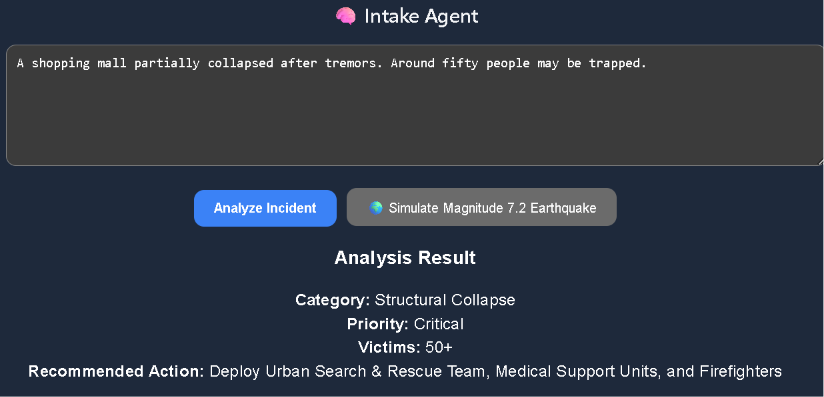
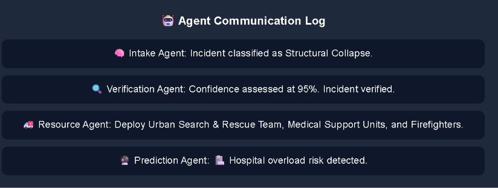
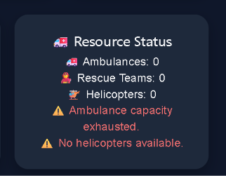
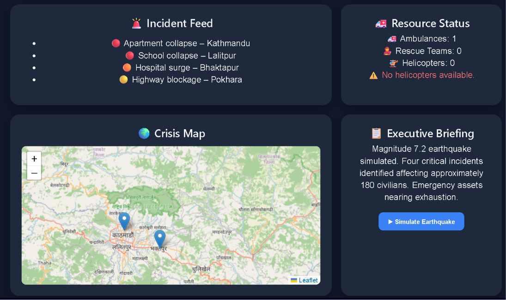

# 🌍 QuakeShield
### AI-Powered Multi-Agent Disaster Intelligence Platform

QuakeShield is an AI-driven disaster response platform designed to assist emergency teams during earthquakes and large-scale crises. It combines Microsoft Phi-4 intelligence with a multi-agent architecture to transform unstructured incident reports into actionable operational insights.

---

## 🚨 Problem Statement

During disasters, emergency responders face three major challenges:

- Information overload from incoming reports.
- Difficulty prioritizing incidents quickly.
- Limited emergency resources that must be allocated efficiently.

Traditional systems only display data. QuakeShield goes a step further by reasoning through incidents and supporting operational decision-making.

---

## 💡 Solution

QuakeShield acts as an intelligent disaster command center.

It can:

- Understand natural language incident reports.
- Extract structured disaster intelligence.
- Verify and classify incidents.
- Allocate emergency resources dynamically.
- Warn when resources become exhausted.
- Simulate large-scale earthquake scenarios.

---

## 🤖 Multi-Agent Architecture

```text
🧠 Intake Agent
        ↓
🤖 Phi-4 Intelligence
        ↓
🔍 Verification Agent
        ↓
🚑 Resource Allocation Agent
        ↓
⚠️ Resource Exhaustion Logic
        ↓
🔮 Prediction Agent
        ↓
📋 Executive Briefing
```

---

## ✨ Key Features

### 🧠 Microsoft Phi-4 Intelligence
- Natural language understanding.
- Structured JSON extraction.
- Confidence scoring.

### 🔍 Verification Agent
- Assesses credibility of incidents.
- Generates verification reports.

### 🚑 Resource Allocation Agent
- Dynamically allocates:
  - Ambulances
  - Urban Search & Rescue Teams
  - Helicopters

### ⚠️ Resource Exhaustion Detection
- Detects depleted emergency assets.
- Triggers operational warnings.

### 🔮 Prediction Agent
- Anticipates secondary impacts.
- Predicts hospital overload risks.

### 🌍 Earthquake Simulation
- One-click Magnitude 7.2 earthquake simulation.
- Multiple simultaneous incidents.
- Agent coordination under stress conditions.

---

## 🛠 Tech Stack

- React
- Vite
- Microsoft Phi-4-mini-instruct
- GitHub Models
- JavaScript
- Leaflet
- Git
- GitHub

---

## 🚀 Installation

Clone the repository:

```bash
git clone https://github.com/vaibhavpandey78k/QuakeShield.git
```

Move into the project:

```bash
cd QuakeShield
```

Install dependencies:

```bash
npm install
```

Create a `.env` file:

```env
VITE_GITHUB_TOKEN=YOUR_GITHUB_TOKEN
```

Run the application:

```bash
npm run dev
```

Open:

```text
http://localhost:5173
```

---

## 🎮 Demo Workflow

### Normal Mode

1. Enter a disaster report.
2. Phi-4 analyzes the incident.
3. Agents coordinate verification.
4. Resources are allocated.
5. Predictions are generated.

### Simulation Mode

1. Click:

```
🌍 Simulate Magnitude 7.2 Earthquake
```

2. Observe:

- Incident Feed updates.
- Executive Briefing changes.
- Resource allocation shifts.
- Resource exhaustion warnings.
- Agent Communication Log evolves.

---

## 📸 Suggested Screenshots

- Phi JSON Analysis
- Agent Communication Log
- Resource Exhaustion Warnings
- Earthquake Simulation Dashboard

---

## 🔒 Security

- API tokens are protected using `.env`.
- Sensitive credentials are excluded using `.gitignore`.

---
## 📸 QuakeShield in Action

### 🧠 Phi-4 Incident Analysis



---

### 🤖 Agent Communication Log



---

### ⚠️ Resource Exhaustion Detection



---

### 🌍 Earthquake Simulation Dashboard



---

### 🔄 Multi-Agent Coordination During Simulation


## 🌟 Future Enhancements

- Real-time earthquake feeds.
- GIS-based deployment routing.
- Volunteer coordination.
- Live hospital availability tracking.
- SMS alert integration.

---

## 👨‍💻 Developed By

**Vaibhav Pandey**

Built as part of an AI disaster response initiative to explore how large language models and agentic systems can support emergency decision-making.

---

## 🏆 QuakeShield

*"Transforming disaster information into coordinated action."*
